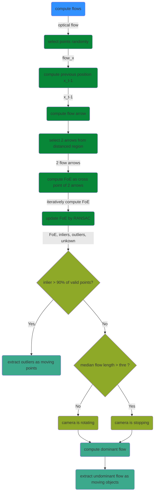

```mermaid
flowchart TD
    A(compute flows) -->|optical flow| B(select points randomly)
    B:::foe --> |flow_x| C(compute previous position x_t-1)
    C:::foe --> |x_t-1| E(compute flow arrow)
    E:::foe --> F(select 2 arrows from distanced region)
    F:::foe --> |2 flow arrows| G(compute FoE as cross point of 2 arrows)
    G:::foe --> |iteratively compute FoE| H(update FoE by RANSAC)
    H:::foe --> |FoE, inliers, outliers, unkown| I{inlier > 90% of valid points?}
    I:::cam --> |Yes| J(extract outliers as moving points):::movpix
    I --> |No| M{median flow length > thre ?}:::cam
    M --> |Yes| N(camera is stopping):::cam
    M --> |No| O(camera is rotating):::cam
    O --> K(compute dominant flow):::movpix
    N --> K
    K --> L(extract undominant flow as moving objects):::movpix

    style A fill:#3390FF
    classDef foe fill:#098739
    classDef cam fill: #8EA928
    classDef movpix fill: #3DA98C
```