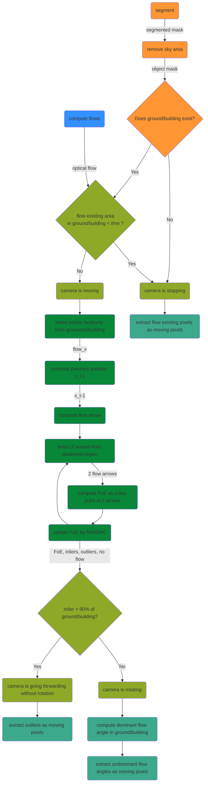

```mermaid
flowchart TD
    D(segment):::seg --> |segmented mask| P(remove sky area):::seg
    P --> |object mask| R{Does ground/building exist?}:::seg
    R --> |Yes| M{flow existing area \n in ground/building < thre ?}:::cam
    R --> |No| N
    A(compute flows) -->|optical flow| M
    M --> |Yes| N(camera is stopping):::cam
    M --> |No| O(camera is moving):::cam
    O --> B(select points randomly from granound/building):::foe
    B --> |flow_x| C(compute previous position x_t-1):::foe
    C --> |x_t-1| E(compute flow arrow):::foe
    E --> F(select 2 arrows from distanced region):::foe
    F --> |2 flow arrows| G(compute FoE as cross point of 2 arrows):::foe
    H --> F
    G --> H(update FoE by RANSAC):::foe
    H --> |FoE, inliers, outliers, no flow| I{inlier > 90% of ground/building?}:::cam
    I --> |Yes| S(camera is going forwarding without rotation):::cam
    S --> J(extract outliers as moving pixels):::movpix
    I --> |No| T(camera is rotating):::cam
    T --> K(compute dominant flow angle in ground/building):::movpix
    N --> Q(extract flow existing pixels as moving pixels):::movpix
    K --> L(extract undominant flow angles as moving pixels):::movpix

    style A fill:#3390FF
    classDef seg fill:#FF9633 
    classDef foe fill:#098739
    classDef cam fill: #8EA928
    classDef movpix fill: #3DA98C
```