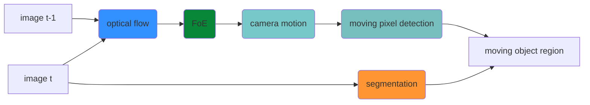

```mermaid
flowchart LR
    imgt-1[image t-1] --> flow(optical flow)
    imgt[image t] --> flow
    flow --> foe(FoE)
    foe --> cam(camera motion)
    cam --> movpix(moving pixel detection)
    imgt --> seg(segmentation)
    movpix --> mov[moving object region]
    seg --> mov

    style flow fill:#3390FF
    style foe fill:#098739
    style cam fill: #0998
    style movpix fill: #0888
    style seg fill:#FF9633
```