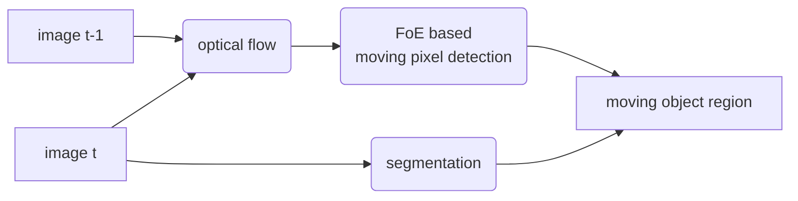

```mermaid
flowchart LR
    imgt-1[image t-1] --> flow(optical flow)
    imgt[image t] --> flow
    flow --> foe(FoE based\n moving pixel detection)
    imgt --> seg(segmentation)
    foe --> mov[moving object region]
    seg --> mov
```