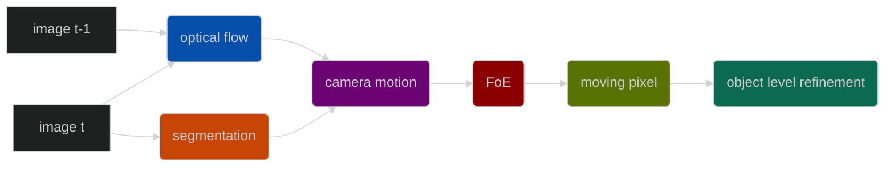

```mermaid
%%{
  init: {
    'theme': 'dark',
    'themeVariables': {
      'fontSize': '28pix',
      'curve': 'linear'
    }
  }
}%%

flowchart LR
    imgt-1[image t-1] --> flow(optical flow)
    imgt[image t] --> flow
    imgt --> seg(segmentation)
    flow --> cam(camera motion)
    seg --> cam
    cam --> foe(FoE)
    foe --> movpix(moving pixel)
    movpix --> objref(object level refinement)

    style flow fill: #0650AC
    style seg fill: #C74606
    style cam fill: #6C0372
    style foe fill: #8B0000
    style movpix fill: #5A7203
    style objref fill: #0C6A51
```